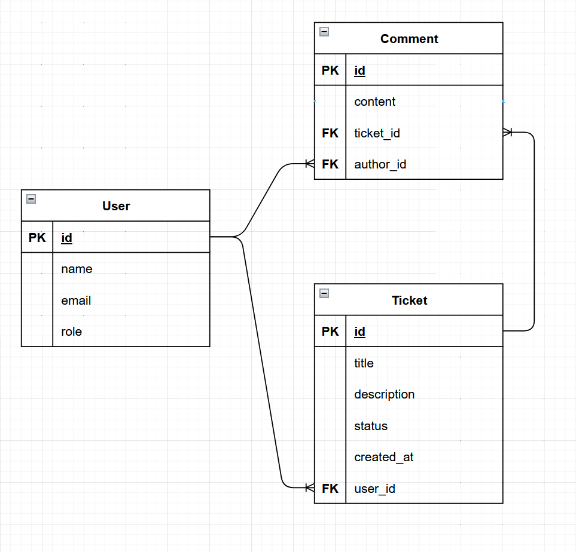
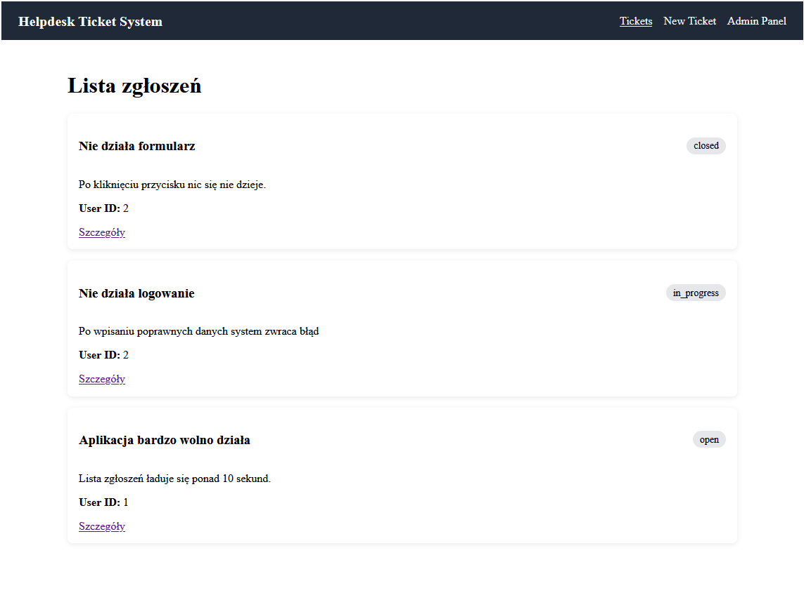
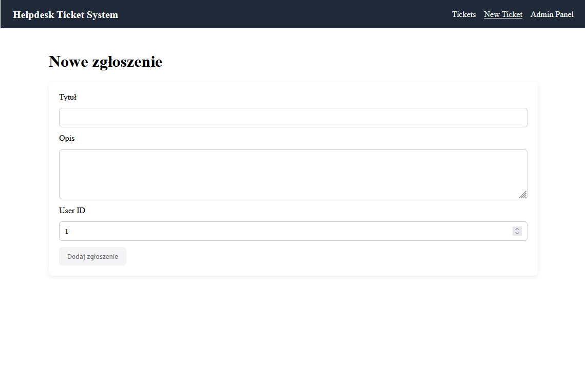
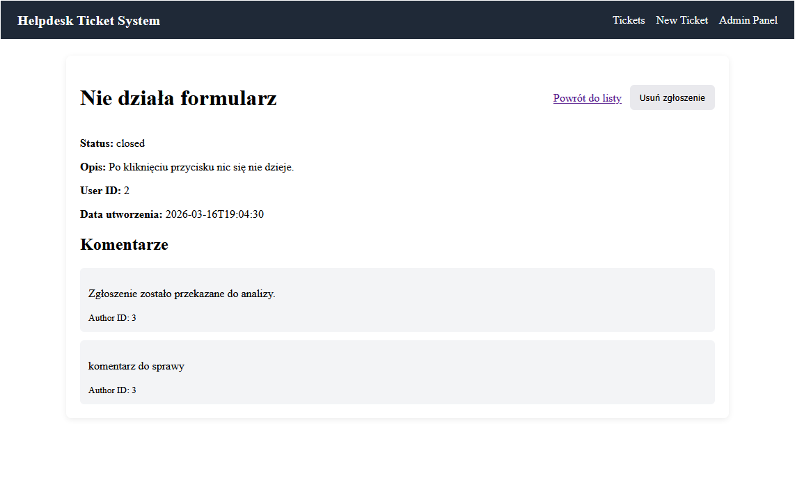
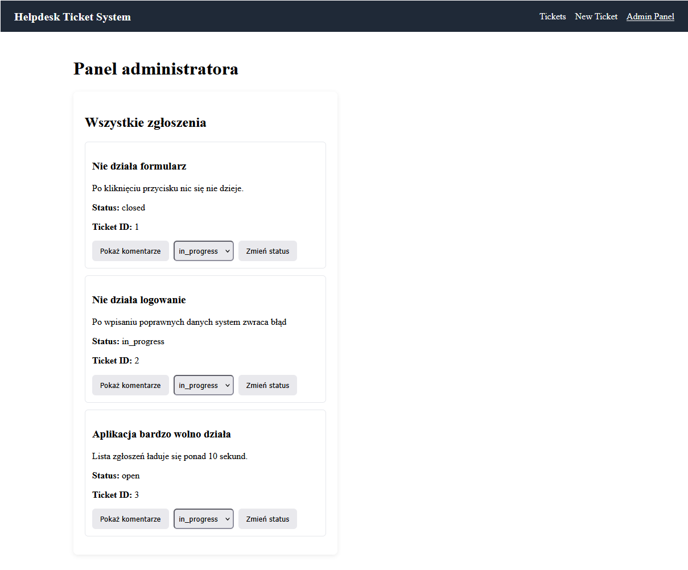

# Helpdesk Ticket System

Projekt Full Stack przedstawiający system zarządzania zgłoszeniami (Helpdesk), umożliwiający użytkownikom zgłaszanie problemów oraz administratorom zarządzanie zgłoszeniami i komentarzami.

---

## Opis projektu

Aplikacja składa się z dwóch głównych części:

* **Frontend (Angular)** – interfejs użytkownika do obsługi zgłoszeń
* **Backend (FastAPI)** – REST API do zarządzania danymi
* **Baza danych (SQLite)** – przechowywanie danych aplikacji

System umożliwia tworzenie zgłoszeń, ich przeglądanie, aktualizację statusów oraz dodawanie komentarzy.

---

## Technologie

### Backend

* Python
* FastAPI
* SQLAlchemy
* SQLite

### Frontend

* Angular
* TypeScript
* Angular HttpClient

### Inne

* REST API
* Git
* Markdown

---

## Funkcjonalności

### Użytkownik

* tworzenie zgłoszeń
* przeglądanie listy zgłoszeń
* podgląd szczegółów zgłoszenia

### Administrator

* przeglądanie wszystkich zgłoszeń
* zmiana statusu zgłoszenia (`open`, `in_progress`, `closed`)
* dodawanie komentarzy do zgłoszeń

---

## Architektura systemu

Struktura aplikacji:

User (Browser) → Angular (Frontend) → FastAPI (Backend) → SQLite (Database)

---

## Diagram UML



---

## Screenshoty

### Lista zgłoszeń



### Formularz dodawania zgłoszenia



### Szczegóły zgłoszenia



### Panel administratora



---

## Uruchomienie projektu

### 1. Backend (FastAPI)

```bash
cd backend
pip install -r requirements.txt
uvicorn app.main:app --reload
```

Backend dostępny pod:
http://127.0.0.1:8000

Dokumentacja API (Swagger):
http://127.0.0.1:8000/docs

---

### 2. Frontend (Angular)

```bash
cd frontend/helpdesk-ui
npm install
ng serve
```

Frontend dostępny pod:
http://localhost:4200

---

## API (przykładowe endpointy)

```http
GET     /tickets
POST    /tickets
GET     /tickets/{id}
PATCH   /tickets/{id}/status
DELETE  /tickets/{id}

GET     /users
POST    /users

GET     /tickets/{id}/comments
POST    /tickets/{id}/comments
```

---

## Baza danych

W projekcie wykorzystano **SQLite** jako bazę danych do celów developmentowych.

Dzięki użyciu ORM (**SQLAlchemy**) aplikacja może zostać łatwo dostosowana do pracy z bazą **PostgreSQL** w środowisku produkcyjnym.

---

## Struktura projektu

```
helpdesk-ticket-system/
├── backend/
├── frontend/
├── docs/
│   ├── architecture.png
│   ├── uml.png
│   └── screenshots/
│       ├── tickets.png
│       ├── form.png
│       ├── details.png
│       └── admin.png
├── README.md
└── .gitignore
```

---

## Autor

Piotr Kut student kierunku Inżynieria i analiza danych
